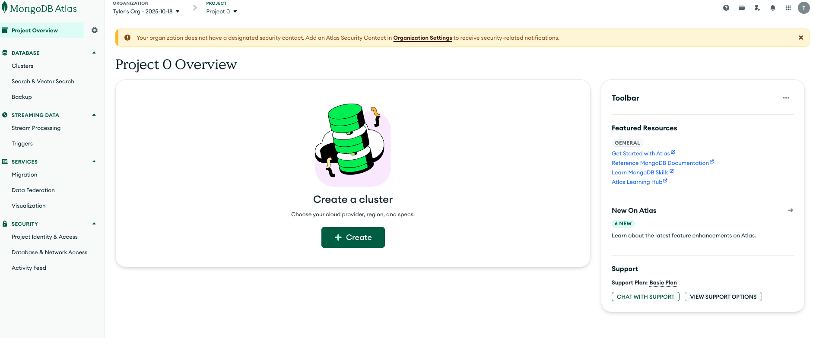
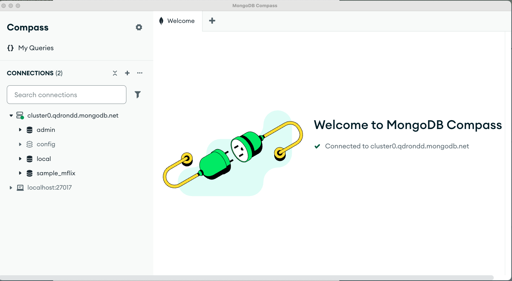
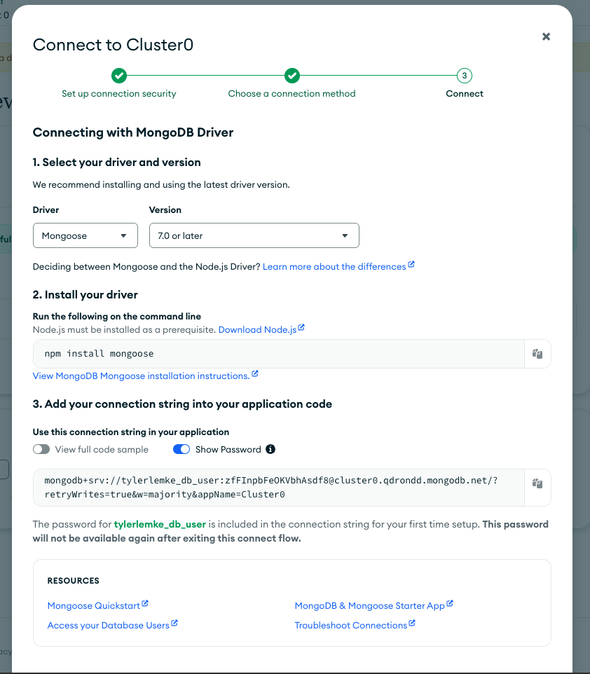
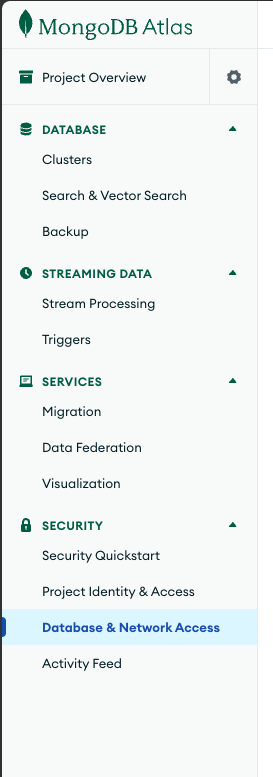
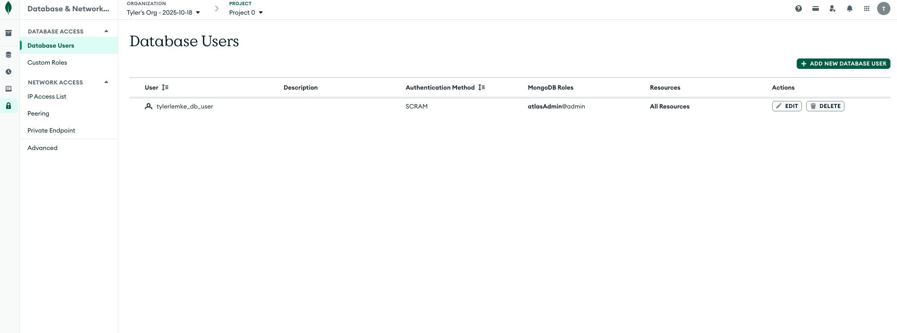
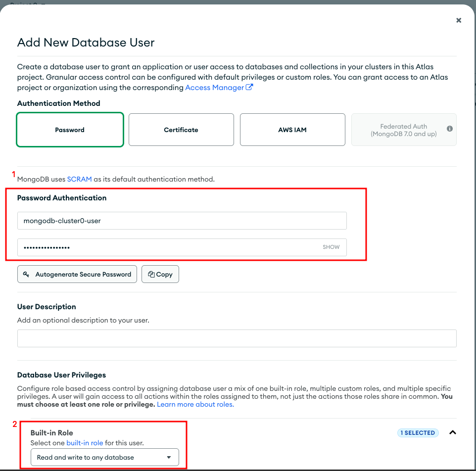

# MongoDB Atlas Setup Guide

1. Go to https://account.mongodb.com/account/register
2. Sign up for an account and skip any MFA or use email
3. Skip personalization
4. Log back in
5. You should land on this page:
   
6. Click **Create** (for creating a cluster)
7. Pick the region closest to you and accept the rest of the defaults
8. Click the **Create Deployment** button
9. If you ever have access issues, make sure your IP address is on the whitelist
10. Copy your username and password and save them in a secure location
11. Click the **Create Database User** button to create the user
12. Click **Choose a connection method**
13. Select **Access your tools through Compass**
14. From step 2, copy the connection string and open Compass
15. In Compass, click **Add New Connection**
16. Paste in the connection string
17. Click **Save and Connect**
    
18. Go back to the MongoDB Atlas site
19. Click on **Connection to your application** > **Drivers**
20. Select **Driver** > **Mongoose**
    
21. Copy the connection string from part 3 - you'll paste this into your `.env` file in the practice folder see readme
27. If you forgot to save your user credentials, you can create a new database user by navigating to **Security** > **Database and Network Access**
    
28. Go to **Database Users** and click **Add New Database User**
    
29. Set up a new user with a username and password (make sure to copy it) and assign the **Built-in Role** of "Read and write to any database"
    