# YouTube API Example

Learn how to use a protected API by integrating with YouTube Data API v3.

## Step 1: Get Your API Key

1. Go to [Google Cloud Console](https://console.cloud.google.com/)
2. Sign in with your Google account
3. Create a new project
   - Click "Select a project" > "NEW PROJECT"
   
   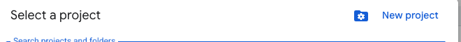
   - Name: `YouTube API Demo`
   - Click "CREATE"
   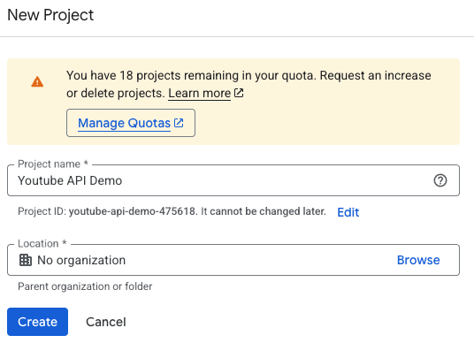
   
4. Enable YouTube Data API v3
   - Go to "APIs & Services" > "Enable APIs and Services"
   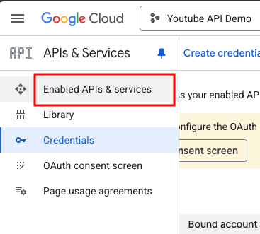
   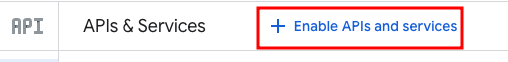
   - Search for "YouTube Data API v3"
   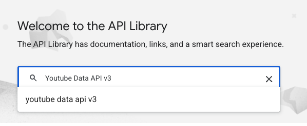
   - Click "ENABLE"
   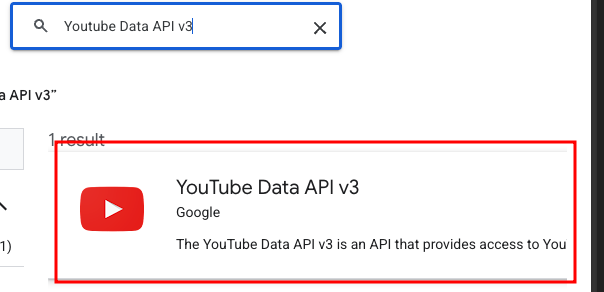
   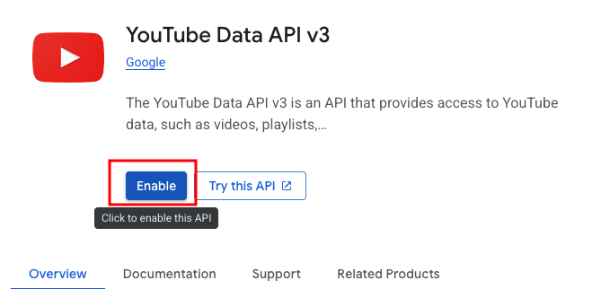
5. Create API credentials
   - Go to "APIs & Services" > "Credentials"
   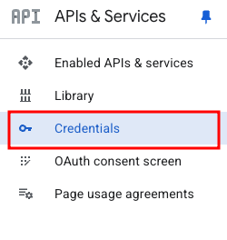
   - Click "+ CREATE CREDENTIALS" > "API key"
   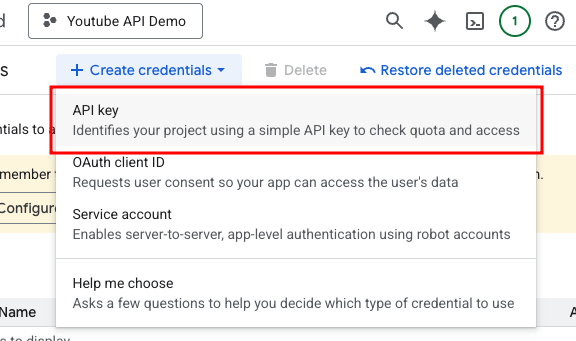
   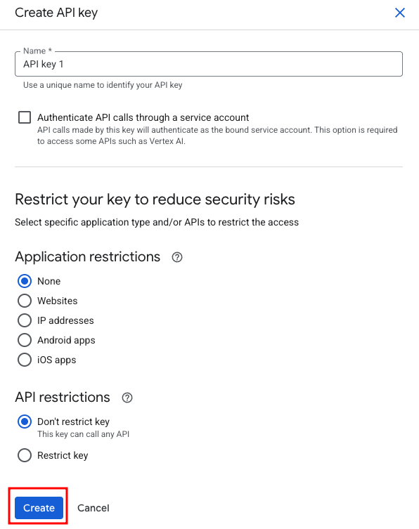
   - Copy your API key (looks like: `AIzaSyB1234567890...`)
   - Create the .env file by copying from example.env
   - Paste in your key
   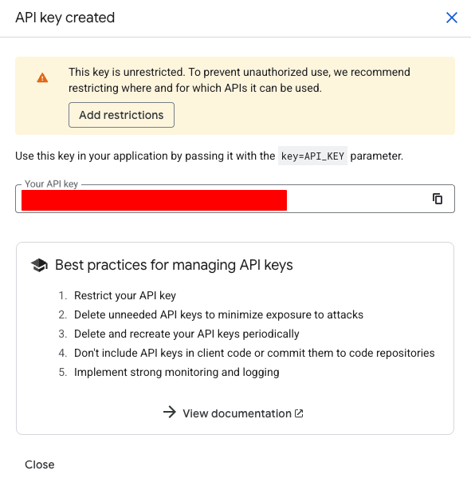
6. Restrict your key (optional but recommended)
   - Click "RESTRICT KEY"
   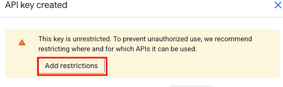
   - Under "API restrictions" select "YouTube Data API v3"
   - Click "SAVE"
   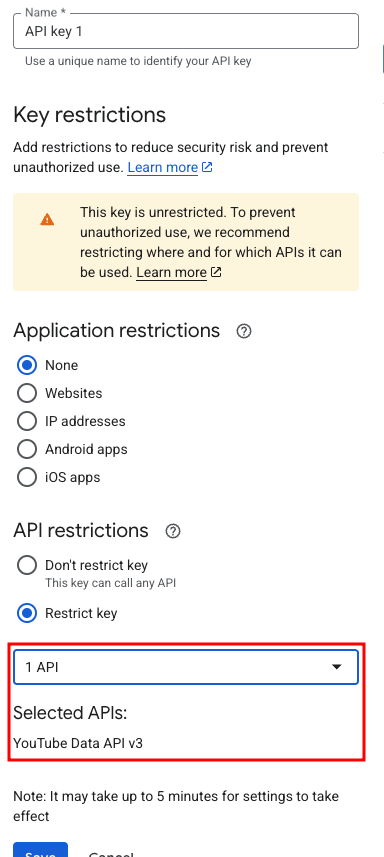

## Step 2: Install and Setup

Install dependencies:

```bash
npm install
```

Create a `.env` file in this directory:

```bash
YOUTUBE_API_KEY=your-api-key-here
PORT=3000
```

Replace `your-api-key-here` with your actual API key from Step 1.

## Step 3: Start the Server

```bash
npm start
```

You should see:
```
YouTube API Server running on http://localhost:3000
```

## Step 4: Test the API

### In Your Browser

Search for videos:
```
http://localhost:3000/search?q=javascript
http://localhost:3000/search?q=nodejs&maxResults=5
```

Get a specific video:
```
http://localhost:3000/video/dQw4w9WgXcQ
```

### Response Format

Search response:
```json
{
  "query": "javascript",
  "totalResults": 10,
  "videos": [
    {
      "title": "JavaScript Tutorial for Beginners",
      "description": "Learn JavaScript in this complete tutorial...",
      "link": "https://www.youtube.com/watch?v=abc123"
    }
  ]
}
```

Video details response:
```json
{
  "title": "Video Title",
  "description": "Video description...",
  "link": "https://www.youtube.com/watch?v=abc123"
}
```

### In Postman

1. Create a GET request to `http://localhost:3000/search`
2. Add query parameter: `q` = `javascript`
3. Click "Send"
4. View the results

## Available Endpoints

- `GET /` - API information
- `GET /search?q=query&maxResults=10` - Search YouTube videos
- `GET /video/:id` - Get video details by ID

## Common Issues

**"ERROR: YOUTUBE_API_KEY is not set"**
- Create a `.env` file with your API key
- Restart the server

**401 Unauthorized**
- Check your API key in `.env`
- Make sure it's copied correctly with no extra spaces

**403 Forbidden**
- YouTube Data API v3 may not be enabled
- Go back to Google Cloud Console and enable it

## Security Notes

- API key is stored in `.env` (not committed to Git)
- `.gitignore` prevents `.env` from being tracked
- Server acts as a proxy to hide your API key from users
- Users call your server, not YouTube directly

## Key Takeaways

1. Get API key from provider (Google Cloud Console)
2. Store key in `.env` file
3. Add `.env` to `.gitignore`
4. Backend makes API calls (keeps key secure)
5. Test in browser or Postman

This pattern works for any protected API.
