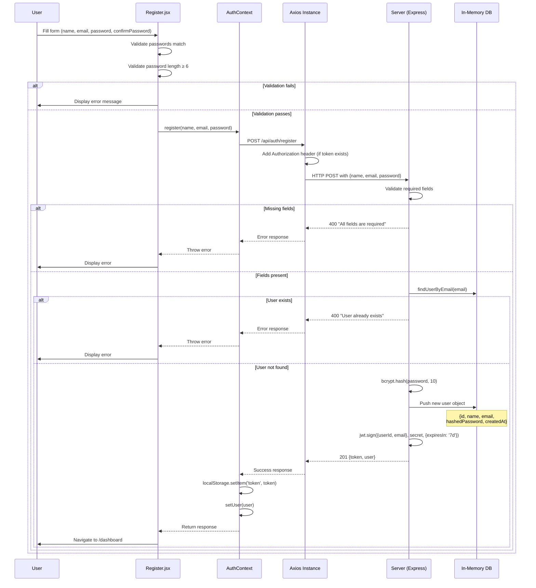

```mermaid
sequenceDiagram
    participant U as User
    participant R as Register.jsx
    participant AC as AuthContext
    participant AX as Axios Instance
    participant S as Server (Express)
    participant DB as In-Memory DB

    U->>R: Fill form (name, email, password, confirmPassword)
    R->>R: Validate passwords match
    R->>R: Validate password length ≥ 6

    alt Validation fails
        R->>U: Display error message
    else Validation passes
        R->>AC: register(name, email, password)
        AC->>AX: POST /api/auth/register
        AX->>AX: Add Authorization header (if token exists)
        AX->>S: HTTP POST with {name, email, password}
        
        S->>S: Validate required fields
        
        alt Missing fields
            S-->>AX: 400 "All fields are required"
            AX-->>AC: Error response
            AC-->>R: Throw error
            R->>U: Display error
        else Fields present
            S->>DB: findUserByEmail(email)
            
            alt User exists
                S-->>AX: 400 "User already exists"
                AX-->>AC: Error response
                AC-->>R: Throw error
                R->>U: Display error
            else User not found
                S->>S: bcrypt.hash(password, 10)
                S->>DB: Push new user object
                Note over DB: {id, name, email,<br/>hashedPassword, createdAt}
                S->>S: jwt.sign({userId, email}, secret, {expiresIn: '7d'})
                S-->>AX: 201 {token, user}
                AX-->>AC: Success response
                AC->>AC: localStorage.setItem('token', token)
                AC->>AC: setUser(user)
                AC-->>R: Return response
                R->>U: Navigate to /dashboard
            end
        end
    end
```